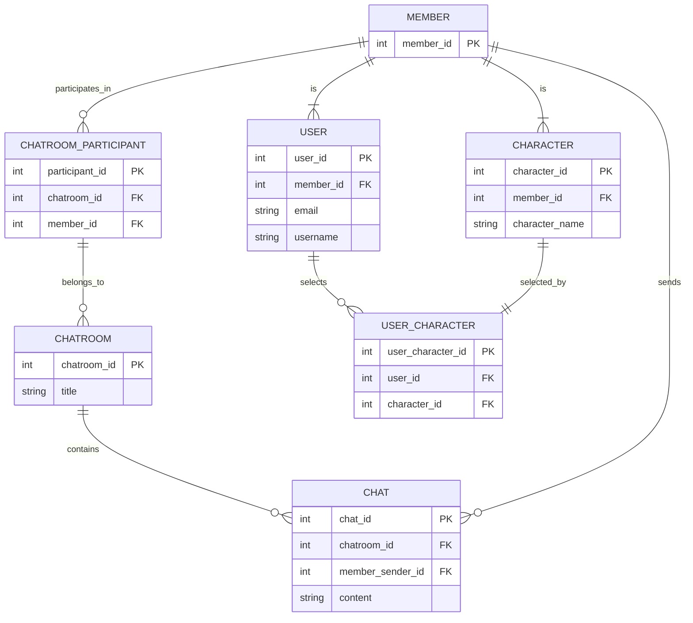

summonbell
アプリの具体的な要件や目的としては、
このアプリは、ディスクトップアプリです。
ユーザーが登録したキャラクターとログインしたユーザーで会話ができるアプリです。
DBにはsqliteを利用します。
キャラクターはキャラクターAPIによるキャラクターに応じた返答を行うことができます。

アプリログイン時点でユーザーはメールアドレスによるログインを行います。
アカウントがなければ、メールアドレスの追加でいくらでもユーザを登録できます。
ユーザはログイン後、アプリ内で好きなキャラクターを追加することができます。
キャラクター追加後、アプリ内から登録済みの好きなキャラクターを選択しチャットを開始することができます。

チャットルームにはユーザー１人に対し、複数のキャラクターを追加することができ、チャットルーム内で複数のキャラクターとチャットを行うことも可能です。

