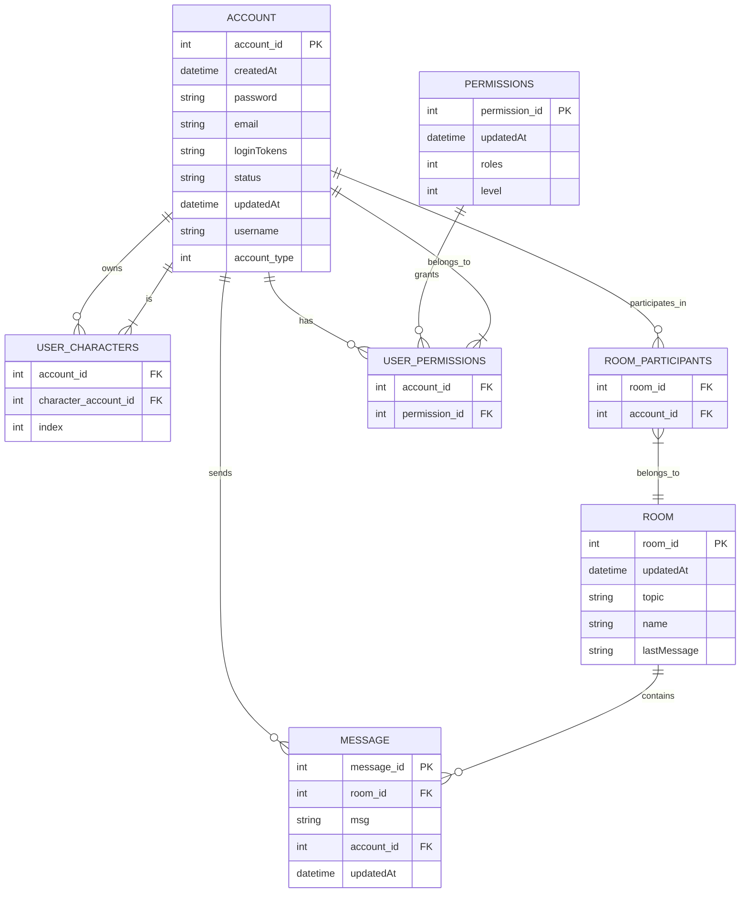

summonbell
アプリの具体的な要件や目的としては、
このアプリは、ディスクトップアプリです。
ユーザーが登録したキャラクターとログインしたユーザーで会話ができるアプリです。
DBにはsqliteを利用します。
キャラクターはキャラクターAPIによるキャラクターに応じた返答を行うことができます。

アプリログイン時点でユーザーはメールアドレスによるログインを行います。
アカウントがなければ、メールアドレスの追加でいくらでもユーザを登録できます。
ユーザはログイン後、アプリ内で好きなキャラクターを追加することができます。
キャラクター追加後、アプリ内から登録済みの好きなキャラクターを選択しチャットを開始することができます。

チャットルームにはユーザー１人に対し、複数のキャラクターを追加することができ、チャットルーム内で複数のキャラクターとチャットを行うことも可能です。


    
```sql
CREATE TABLE ACCOUNT (
    account_id INTEGER PRIMARY KEY AUTOINCREMENT,
    createdAt TEXT,
    password TEXT,
    email TEXT, -- ユーザーに直接紐づくbotは同じメアドとする
    loginTokens TEXT,
    status TEXT,
    updatedAt TEXT,
    username TEXT,
    account_type TEXT
);

CREATE TABLE USER_CHARACTERS (
    account_id INTEGER,
    character_account_id INTEGER,
    index INTEGER, -- ポケモンシステム採用１０体までにしておき場所で割り振る
    FOREIGN KEY (account_id) REFERENCES ACCOUNT(account_id),
    FOREIGN KEY (character_account_id) REFERENCES ACCOUNT(account_id)
);

CREATE TABLE ROOM (
    room_id INTEGER PRIMARY KEY AUTOINCREMENT,
    updatedAt TEXT,
    topic TEXT,
    name TEXT,
    lastMessage TEXT
);

CREATE TABLE ROOM_PARTICIPANTS (
    room_id INTEGER,
    account_id INTEGER,
    FOREIGN KEY (room_id) REFERENCES ROOM(room_id),
    FOREIGN KEY (account_id) REFERENCES ACCOUNT(account_id)
);

CREATE TABLE MESSAGE (
    message_id INTEGER PRIMARY KEY AUTOINCREMENT,
    room_id INTEGER,
    msg TEXT,
    account_id INTEGER,
    updatedAt TEXT,
    FOREIGN KEY (room_id) REFERENCES ROOM(room_id),
    FOREIGN KEY (account_id) REFERENCES ACCOUNT(account_id)
);

CREATE TABLE PERMISSIONS (
    permission_id INTEGER PRIMARY KEY AUTOINCREMENT,
    updatedAt TEXT,
    roles TEXT,
    level TEXT
);

CREATE TABLE USER_PERMISSIONS (
    account_id INTEGER,
    permission_id INTEGER,
    FOREIGN KEY (account_id) REFERENCES ACCOUNT(account_id),
    FOREIGN KEY (permission_id) REFERENCES PERMISSIONS(permission_id)
);
```