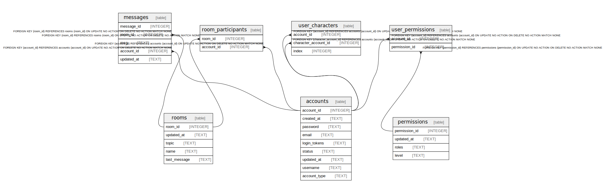

# db.sqlite

## Tables

| Name | Columns | Comment | Type |
| ---- | ------- | ------- | ---- |
| [accounts](accounts.md) | 9 |  | table |
| [messages](messages.md) | 5 |  | table |
| [permissions](permissions.md) | 4 |  | table |
| [room_participants](room_participants.md) | 2 |  | table |
| [rooms](rooms.md) | 5 |  | table |
| [user_characters](user_characters.md) | 3 |  | table |
| [user_permissions](user_permissions.md) | 2 |  | table |

## Relations

---

> Generated by [tbls](https://github.com/k1LoW/tbls)
