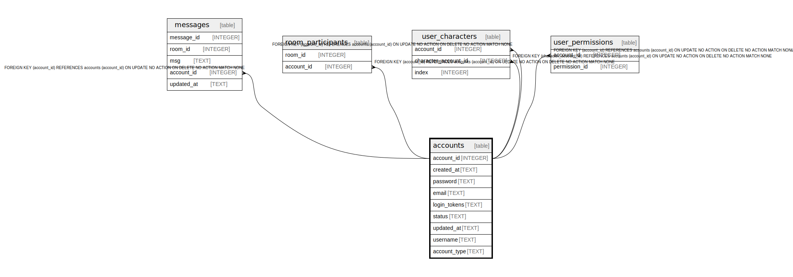

# accounts

## Description

<details>
<summary><strong>Table Definition</strong></summary>

```sql
CREATE TABLE "accounts" ("account_id" INTEGER NOT NULL PRIMARY KEY AUTOINCREMENT, "created_at" TEXT NOT NULL, "password" TEXT NOT NULL, "email" TEXT NOT NULL, "login_tokens" TEXT NULL, "status" TEXT NULL, "updated_at" TEXT NOT NULL, "username" TEXT NOT NULL, "account_type" TEXT NOT NULL)
```

</details>

## Columns

| Name | Type | Default | Nullable | Children | Parents | Comment |
| ---- | ---- | ------- | -------- | -------- | ------- | ------- |
| account_id | INTEGER |  | false | [messages](messages.md) [room_participants](room_participants.md) [user_characters](user_characters.md) [user_permissions](user_permissions.md) |  |  |
| created_at | TEXT |  | false |  |  |  |
| password | TEXT |  | false |  |  |  |
| email | TEXT |  | false |  |  |  |
| login_tokens | TEXT |  | true |  |  |  |
| status | TEXT |  | true |  |  |  |
| updated_at | TEXT |  | false |  |  |  |
| username | TEXT |  | false |  |  |  |
| account_type | TEXT |  | false |  |  |  |

## Constraints

| Name | Type | Definition |
| ---- | ---- | ---------- |
| account_id | PRIMARY KEY | PRIMARY KEY (account_id) |

## Relations



---

> Generated by [tbls](https://github.com/k1LoW/tbls)
