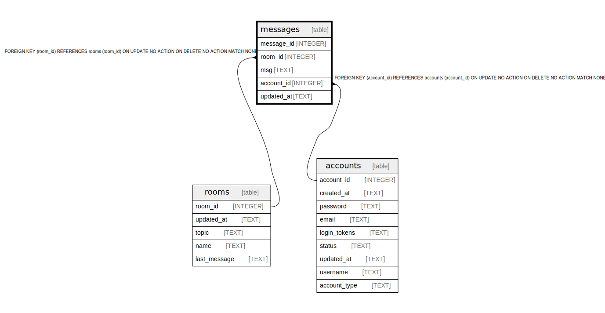

# messages

## Description

<details>
<summary><strong>Table Definition</strong></summary>

```sql
CREATE TABLE "messages" ("message_id" INTEGER NOT NULL PRIMARY KEY AUTOINCREMENT, "room_id" INTEGER REFERENCES rooms(room_id), "msg" TEXT NOT NULL, "account_id" INTEGER REFERENCES accounts(account_id), "updated_at" TEXT NOT NULL)
```

</details>

## Columns

| Name | Type | Default | Nullable | Children | Parents | Comment |
| ---- | ---- | ------- | -------- | -------- | ------- | ------- |
| message_id | INTEGER |  | false |  |  |  |
| room_id | INTEGER |  | true |  | [rooms](rooms.md) |  |
| msg | TEXT |  | false |  |  |  |
| account_id | INTEGER |  | true |  | [accounts](accounts.md) |  |
| updated_at | TEXT |  | false |  |  |  |

## Constraints

| Name | Type | Definition |
| ---- | ---- | ---------- |
| message_id | PRIMARY KEY | PRIMARY KEY (message_id) |
| - (Foreign key ID: 0) | FOREIGN KEY | FOREIGN KEY (account_id) REFERENCES accounts (account_id) ON UPDATE NO ACTION ON DELETE NO ACTION MATCH NONE |
| - (Foreign key ID: 1) | FOREIGN KEY | FOREIGN KEY (room_id) REFERENCES rooms (room_id) ON UPDATE NO ACTION ON DELETE NO ACTION MATCH NONE |

## Relations



---

> Generated by [tbls](https://github.com/k1LoW/tbls)
