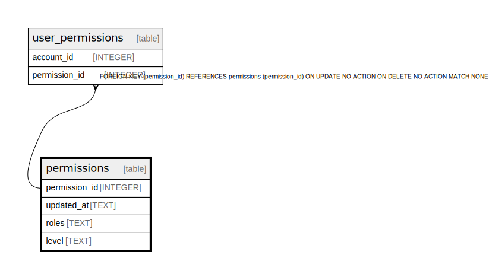

# permissions

## Description

<details>
<summary><strong>Table Definition</strong></summary>

```sql
CREATE TABLE "permissions" ("permission_id" INTEGER NOT NULL PRIMARY KEY AUTOINCREMENT, "updated_at" TEXT NOT NULL, "roles" TEXT NOT NULL, "level" TEXT NOT NULL)
```

</details>

## Columns

| Name | Type | Default | Nullable | Children | Parents | Comment |
| ---- | ---- | ------- | -------- | -------- | ------- | ------- |
| permission_id | INTEGER |  | false | [user_permissions](user_permissions.md) |  |  |
| updated_at | TEXT |  | false |  |  |  |
| roles | TEXT |  | false |  |  |  |
| level | TEXT |  | false |  |  |  |

## Constraints

| Name | Type | Definition |
| ---- | ---- | ---------- |
| permission_id | PRIMARY KEY | PRIMARY KEY (permission_id) |

## Relations



---

> Generated by [tbls](https://github.com/k1LoW/tbls)
