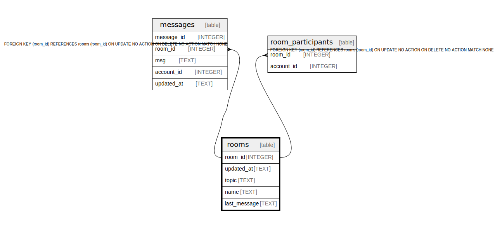

# rooms

## Description

<details>
<summary><strong>Table Definition</strong></summary>

```sql
CREATE TABLE "rooms" ("room_id" INTEGER NOT NULL PRIMARY KEY AUTOINCREMENT, "updated_at" TEXT NOT NULL, "topic" TEXT NULL, "name" TEXT NOT NULL, "last_message" TEXT NULL)
```

</details>

## Columns

| Name | Type | Default | Nullable | Children | Parents | Comment |
| ---- | ---- | ------- | -------- | -------- | ------- | ------- |
| room_id | INTEGER |  | false | [messages](messages.md) [room_participants](room_participants.md) |  |  |
| updated_at | TEXT |  | false |  |  |  |
| topic | TEXT |  | true |  |  |  |
| name | TEXT |  | false |  |  |  |
| last_message | TEXT |  | true |  |  |  |

## Constraints

| Name | Type | Definition |
| ---- | ---- | ---------- |
| room_id | PRIMARY KEY | PRIMARY KEY (room_id) |

## Relations



---

> Generated by [tbls](https://github.com/k1LoW/tbls)
